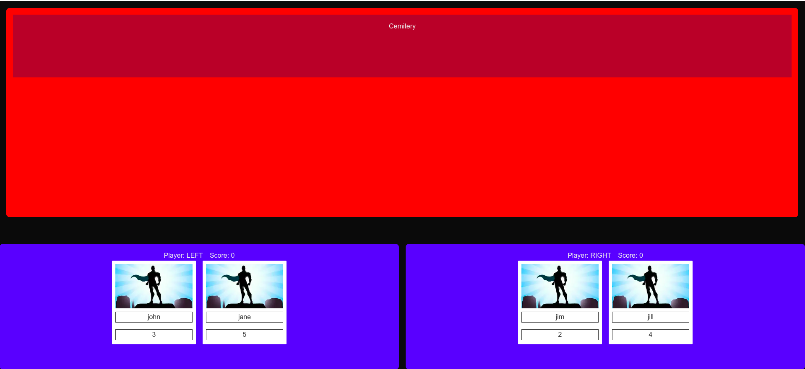
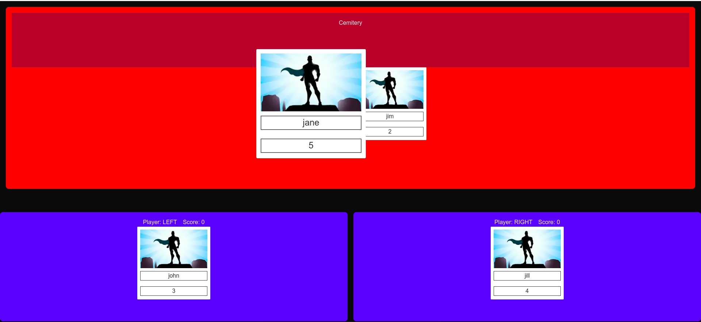
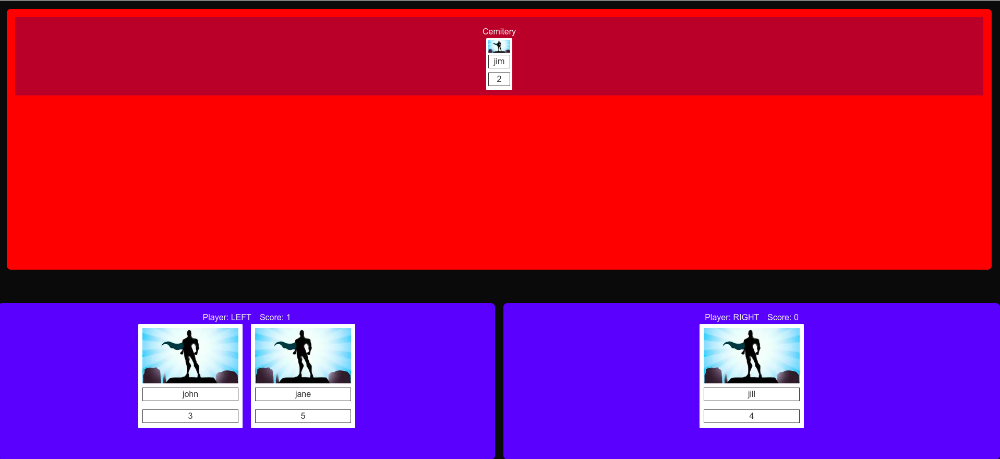
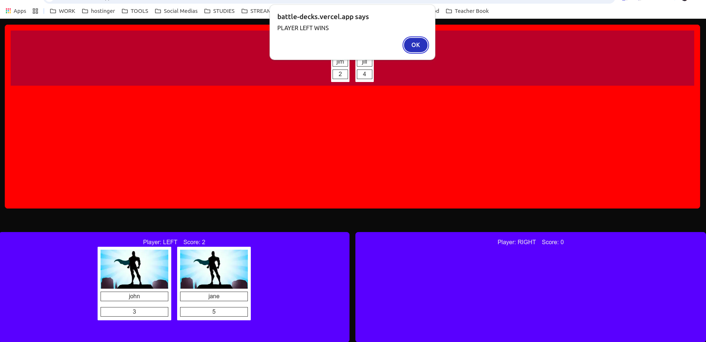
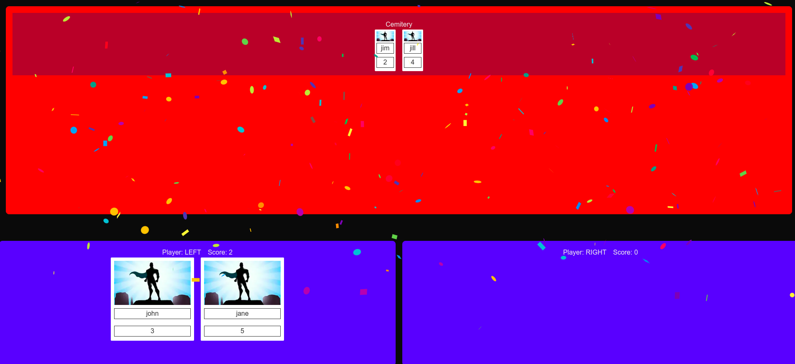

# Battle

This small project is a simple card game. There are two players, whoever has a higher power value between them will win the game.

## Testing Live
https://battle-decks.vercel.app

## Install dependences

```bash
yarn install
```

## Run project in development mode

```bash
yarn dev
```

## Build project in production mode

```bash
yarn build
```

## Initial match board



## The battle



## Loser in the cemetery



## Winner



## Confetti (End Game)

